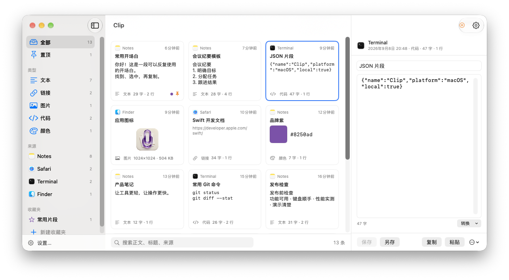

# Clip

[English](README_EN.md)

原生 macOS 剪贴板库：快速取用，轻装常驻。左边筛、中间挑、右边改，全 Swift，本地存储。

[产品主页与实机视频](https://app-mac-clips.tianli.cyou/) · [与 Deck 的区别及实测口径](promotion/COMPARISON.md)

build 26 本机安装占用约 **3.3 MB**。同数据图片浏览测试，内存从 **275.5 降至 117.3 MiB（约 57%）**，这是 Clip 自身优化前后的结果。键盘优先、少占资源和快速响应是持续优化方向；尚无同负载计时支持“比 Deck 更快”的结论。当前暂无公开安装包。

键盘操作：网格获得焦点后，方向键按当前列数移动，Shift + 方向键扩选，Home / End 到本页首尾，Page Up / Down 移动三行，Return 复制所选记录，Esc 清除选择。选中项自动滚入视野；Tab 在控件间移动。搜索和正文编辑中的方向键继续移动文字光标。自定义全局快捷键仍默认不绑定。

隐藏主窗口会释放界面和预览缓存，保留选择与当前未保存草稿；后台继续记录，重新打开时刷新列表。卡片预览按 512 像素、详情按 1600 像素上限解码，缓存有容量上限；复制和导出仍使用原始图片。

- 记录文本 / 富文本 / 链接 / 图片 / 文件 / 代码 / 颜色，自动识别类型；同内容再复制只顶上不重复
- 左栏按类型、来源 app、收藏夹筛；搜索正文、标题、来源；分页
- 选中一条直接改正文：「保存」覆盖原条目，「另存」保留原条目；改标题；一键转换（纯文本 / 去空白 / 大小写 / 去换行 / JSON 格式化）
- 多选：批量删除、加入收藏夹、合并成一条
- 收藏夹：名字 / 图标 / 颜色 / 排序；置顶和收藏夹里的永不淘汰
- 「粘贴」按钮切回你原来的 app 并自动补 ⌘V（需辅助功能授权；没授权就只放进剪贴板）
- 首次启动自动导入 Deck 的历史（只读 Deck 的库）
- 忽略指定 app、跳过密码管理器标记的内容、保留上限与时长、纯文本模式
- 自定义快捷键可在「设置 → 快捷键」录制，默认未绑定；每项均可选择「仅 Clip 内」或「全局」。全局操作使用 Clip 中保留的选择，清除立即解绑，冲突或注册失败有提示，不自动退到其他按键。`clipbook://toggle` 继续供外部自动化使用。

构建：`./build.sh`（安装名由 catalog.yaml 的 display_name 派生）。

链接标题现在流式读取，到 256 KiB 主动取消请求，服务器忽略 Range 也不会下载整个响应。构建支持 `--build-only`，安装不强杀正在运行的应用。针对性网络回归：`bash tests/test-link-title.sh`。

应用 ID、`clipbook://` 自动化和 `~/Library/Application Support/Clipbook/` 保持兼容。构建复用总部 Xcode 选择器、CodingKey 检查与图标转换器。

Clip 是独立 macOS 应用，出现在 Dock 与 `⌘Tab` 切换器中，启动及点击 Dock 图标都会打开主窗口，同时保留菜单栏入口。设置窗口分为通用与快捷键，可从左栏底部或应用菜单打开。标准 `⌘C` 在 Clip 内复制全部所选记录；有文本选区时优先复制选中文字。多条文本按显示顺序以空行分隔，文件和图片保留原生剪贴板载荷。批量操作条也提供「复制」。复制动作允许录制应用内 `⌘C`，或为其他组合选择应用内/全局。记录偏好自动保存、无需保持设置窗口打开；保留规则在下次记录时执行。删除记录先确认；开机自启失败和等待系统批准的状态会显示。

隔离 UI 验收可传入 `CLIPBOOK_HOME` 与 `CLIPBOOK_PREFERENCES_SUITE`，分别隔离历史库和偏好；自定义数据目录不会自动导入 Deck。生产自检覆盖默认零绑定、录制配置持久化、作用域切换、解绑、注册失败与真实动作分发。
