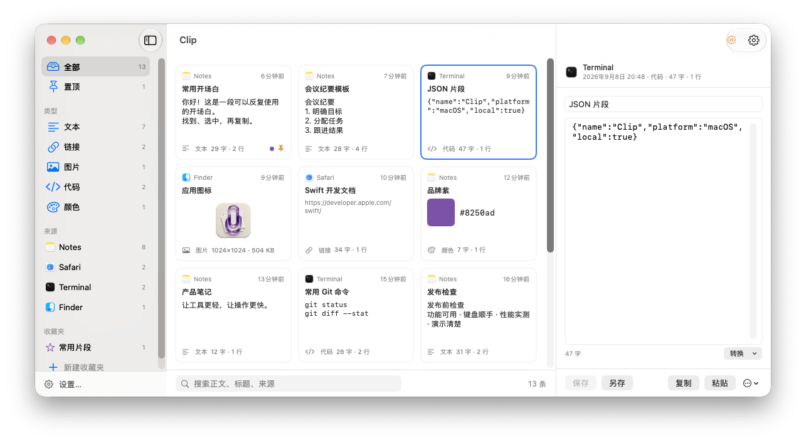

# Clip

2026-10-05：[截图、录屏、OCR 与剪贴板统一应用 PRD](docs/PRD-capture-ocr-clipboard.md)。计划沿现有 Clip 扩展；新增功能尚未实现，CleanShot X、Deck、TextSniper 保留。

应用菜单和菜单栏新增「配置与更新…」：可导出、导入设置，或选择开启 iCloud 配置同步（默认关闭）。同步采集排除、保留规则、纯文本/链接标题偏好、提示音和快捷键；暂停采集、登录项与权限按设备设置。两台 Mac 使用同一 Apple 账户和 iCloud Drive，分别开启配置同步后，新机优先恢复已有设置，恢复前自动备份。剪贴板历史仍使用原有「iCloud 历史归档」开关与 CloudKit。「检查更新…」读取对应 cloud/local 版本的私有 iCloud 发行目录，避免跨版本替换。

**中文** | [English](README_EN.md)


原生 macOS 剪贴板库：快速取用，轻装常驻。左边筛、中间挑、右边改，全 Swift，本地存储。

设置 → iCloud 可开启独立历史归档，首次整理最近 500 条及之后的新记录，在 iPhone/iPad 的 Clip 中取用；Mac 本地清理不删除云端归档。默认关闭，不开启时不初始化云端数据库。上方实测为默认关闭同步时的占用，开启后会增加。

要让 Mac 复制的内容出现在 iPhone：两端使用同一 Apple 账户并启用 iCloud Drive；Mac 打开 **设置 → iCloud → iCloud 历史归档**，iPhone Clip 打开 **设置 → iCloud 同步 → 同步 Clip 历史**。保持 Mac Clip 运行，新复制的文本、链接和图片会加入同步归档；在手机的「全部历史」查看、点开并复制，再到其他 App 粘贴。首次验证让两端都保持打开，等待同步状态更新。手机接收历史不会自动覆盖系统剪贴板；文件路径不上传，富文本按纯文本归档。App Store／TestFlight 的手机端使用 Production，Mac 构建也需要匹配的 CloudKit 环境。

[产品主页与实机视频](https://app-mac-clips.tianli.cyou/) · [与 Deck 的区别及实测口径](promotion/COMPARISON.md)



<!-- lightweight:start -->
## 资源占用

| 安装包 | 空闲内存 | 空闲 CPU | 冷启动到窗口出现 |
|---|---|---|---|
| **2.1 MB**（装好后 3.1 MB） | **56.6 MB** | **0.07%** | **488 ms** |

原生 SwiftUI/AppKit，零第三方依赖，历史存系统 SQLite；每 0.25 秒只比对一次剪贴板变更计数；图片按预览尺寸解码、缓存限 48 张，隐藏主窗口即卸载界面。

其它运行组件（设备和采样窗口各自独立，数值不直接相加）：

- 本机 CloudKit 版（窗口隐藏常驻）：v1.1.1 (48)；2026-09-26；Mac16,12 / Apple M4 / macOS 27.2；安装后占用 2.4 MB；内存 26.2 MB；CPU 0.03%；速度 未测；CloudKit 功能开关为 True；主窗口隐藏，保留原有用户偏好与真实数据。该窗口仅代表空闲常驻，未触发上传、下载或新增复制，不表示云同步传输峰值。

<sub>v1.2.1 (78) · Mac16,12 / Apple M4 / macOS 27.2 · 本机真实剪贴板库的快照副本（隔离数据目录，不碰原库），2902 条记录 · 2026-10-06。数字来自所列设备实测，版本更新后重新测量。内存口径为 phys_footprint；CPU 为 60 秒采样窗内 CPU 时间 ÷ 墙钟；大小按十进制 MB。原始数据见 [perf/lightweight.json](perf/lightweight.json)。</sub>
<!-- lightweight:end -->

同数据图片浏览测试中，内存从 **275.5 降至 117.3 MiB（约 57%）**，这是 Clip 自身优化前后的结果（build 26）。尚无同负载计时支持“比 Deck 更快”的结论。

键盘操作：网格获得焦点后，方向键按当前列数移动，Shift + 方向键扩选，Home / End 到本页首尾，Page Up / Down 移动三行，Return 复制所选记录，Esc 清除选择。选中项自动滚入视野；Tab 在控件间移动。搜索和正文编辑中的方向键继续移动文字光标。自定义全局快捷键仍默认不绑定。

隐藏主窗口会释放界面和预览缓存，保留选择与当前未保存草稿；后台继续记录，重新打开时刷新列表。卡片预览按 512 像素、详情按 1600 像素上限解码，缓存有容量上限；复制和导出仍使用原始图片。

- 记录文本 / 富文本 / 链接 / 图片 / 文件 / 代码 / 颜色，自动识别类型；同内容再复制只顶上不重复
- 左栏按类型、来源 app、收藏夹筛；搜索正文、标题、来源；分页
- 选中一条直接改正文：「保存」覆盖原条目，「另存」保留原条目；改标题；一键转换（纯文本 / 去空白 / 大小写 / 去换行 / JSON 格式化）
- 多选：批量删除、加入收藏夹、合并成一条
- 收藏夹：名字 / 图标 / 颜色 / 排序；置顶和收藏夹里的永不淘汰
- 「粘贴」按钮切回你原来的 app 并自动补 ⌘V（需辅助功能授权；没授权就只放进剪贴板）
- 首次启动自动导入 Deck 的历史（只读 Deck 的库）
- 忽略指定 app、跳过密码管理器标记的内容、保留上限与时长、纯文本模式
- 自定义快捷键可在「设置 → 快捷键」录制，默认未绑定；每项均可选择「仅 Clip 内」或「全局」。全局操作使用 Clip 中保留的选择，清除立即解绑，冲突或注册失败有提示，不自动退到其他按键。`clipbook://toggle` 继续供外部自动化使用。

## 命令行 `clip`（给 agent 与脚本）

界面给人用，命令行给 agent 用。`clip` 是 Clip.app 自带的同一个已签名程序（`Clip.app/Contents/Resources/bin/clip → ../../MacOS/Clipbook`），与窗口共用同一套业务代码和同一个库：`ClipStore`（入库、去重、编辑、淘汰）、`Classifier`、`Paster`、`DeckImporter`、`AppSettings`，以及窗口按钮用的共享校验 `ClipRules`（合并限制、收藏夹图标/颜色白名单、转换可用范围、导出）。不启动界面、不抢焦点，`--help` 约 20 ms。

安装：`./build.sh` 装好 App 后自动运行 `scripts/install-cli.py`，建立 `~/.local/bin/clip → /Applications/Clip.app/Contents/Resources/bin/clip`；已存在的无关文件或链接不会被覆盖。也可手动执行 `python3 scripts/install-cli.py /Applications/Clip.app`。

```bash
clip status --json                         # 版本、App 是否运行、记录数、记录偏好、Deck、iCloud 开关
clip stats --json                          # 左栏计数：类型 / 来源 app / 收藏夹
clip list --kind link --limit 20 --json    # 与网格相同的排序、筛选与分页；--no-text 只给元数据
clip search 发票 --json                     # = list --query
clip show 1234 --json                      # 全文、标题、链接页面标题、文件路径（含是否存在）、原图路径、可用转换
clip add --text "https://example.com" --json      # 与复制入库同一路径：识别类型、同内容顶上、按设置抓链接标题
echo "草稿" | clip add --stdin --title 备忘 --json
clip edit 1234 --text "新正文" --title 标题       # =「保存」：先校验再写，只写有变化的部分
clip transform 1234 json                   # =「转换」，结果保存；默认不动剪贴板，--copy 才写入
clip merge 12 13 14 --json                 # =「合并成一条」（图片、文件不能合并）
clip pin 1234 · clip unpin 1234
clip delete 12 13 --yes                    # 不可撤销，必须 --yes；--dry-run 只报数
clip clear --dry-run --json                # 清空历史（保留置顶与收藏夹里的），执行需 --yes
clip collection create 工作 --icon briefcase --color '#16a34a'
clip collection add 工作 1234 1235 · clip collection move 工作 up · clip collection delete 工作 --yes
clip settings --json · clip settings set maxItems 3000 · clip pause · clip resume · clip ignore add com.example.app
clip settings set launchAtLogin true --dry-run     # 开机自启（系统登录项）；去掉 --dry-run 才生效
clip import-deck --json                    # =「导入 Deck 历史」，可重复执行
clip export 1234 -o ~/Desktop/shot.png     # 图片原图
clip cloud status --json · clip cloud list --favorites --json   # iCloud 状态与本机归档缓存（只读，与手机列表同一规则）
clip cloud show <key> --json · clip cloud show <key> -o photo.png   # 归档里一条的全文与来源；导出图片（key 与 local_id 来自 cloud list）
clip cloud push --dry-run --json           # 「补充最近历史」待归档条数；--yes 请运行中的 Clip 执行
clip cloud on --yes · clip cloud off --yes # 请运行中的 Clip 拨「iCloud 历史归档」开关
clip shortcut list --json · clip shortcut scope search global · clip shortcut clear search   # 快捷键的查看、作用范围、清除；组合键仍在窗口里由本人录制
clip config status --json · clip config export -o clip-config.json · clip config import clip-config.json --yes   # 「配置与更新」的导出与导入
clip config sync on --yes                  # 请运行中的 Clip 打开「使用 iCloud 记住配置」
clip update check --json                   # 「检查更新」：当前版本、此渠道最新版本、有没有新版、怎么升级（只读，不下载不安装）
clip copy 1234                             # 改写系统剪贴板：只在用户明确要求时使用
```

约定：每个命令都有 `--help`（退出 0）和 `--json`（稳定对象，含 `"ok"`；失败时 `"ok": false` 与 `"error"`）。JSON 的 `"command"` 是完整命令路径（如 `collection create`、`cloud list`），成功与失败相同。退出码 `0` 成功、`1` 运行错误、`2` 参数错误或缺少 `--yes`、`3` 记录/收藏夹/库不存在、`4` 需要运行中的 Clip 或已安装的 App（或本地版不含 iCloud）、`5` 库或导入正被占用。读命令以只读方式打开库，不建目录、不建库、不迁移、不写偏好。写命令沿用窗口的校验与取值范围（最多保留 100–100000 条，保留时长 0/7/30/90/365 天，图标与颜色白名单，富文本才可转纯文本，图片/文件不能改正文或合并），并按「最多保留 / 保留时长」淘汰旧的无保护记录；`clip add` 的来源记为 Clip CLI（`cyou.tianli.clipbook.cli`）；同内容已存在时与再次复制相同：顶到最上，来源也改记为这次的来源，`--json` 的 `previous_source` 给出原来源（要保留原来源用 `--from <id>`，即「另存」）。`clip edit` 先校验全部参数再写，被拒绝时记录不变；正文与原来相同则不重写，富文本不会被降成纯文本。Deck 导入在 App 与命令行之间加了进程锁，同时只跑一个。写完会发一个本机通知，运行中的 Clip（本版起）随即重新读取列表或偏好；`clip copy` 写入的剪贴板带 `org.nspasteboard.source` 标记，运行中的 Clip 不会把它当成新复制再记一次、也不响提示音。隔离运行用 `CLIPBOOK_HOME`、`CLIPBOOK_PREFERENCES_SUITE`，再加 `CLIPBOOK_BACKGROUND=1` 时 `copy` 写入隔离的命名剪贴板。

iCloud：同步由 App 进程持有，命令行从不打开同步库写入。`cloud status` / `cloud list` 只读打开本机归档缓存，列表直接调用手机端的 `ClipLibrary.list`（同一份代码：每个内容取最新一行、删除标记隐藏、新的在上、筛选与搜索相同），新鲜度取决于 App 上次同步。`cloud push`（=「补充最近历史」）与 `cloud on|off`（=「iCloud 历史归档」开关）会上传或停止同步你的 iCloud，必须 `--yes`，由运行中的 Clip 执行（App 做账户检查；Clip 未运行时退出码 4），结果用 `cloud status` 回读（`enabled`、`recent_pending`、归档标记计数）。iCloud 开着时，`clip add` / `edit` / 导入写入后运行中的 Clip 会像对待新复制一样把最新记录归档；Clip 没在运行时，下次启动补上。开机自启 `settings set launchAtLogin` 调用与设置页开关同一段代码（系统登录项），只对安装在 Applications 的 Clip 生效，隔离运行时退出码 4。

只在 App 里（要真人，或只在窗口里有意义）：粘贴到前一个 App（切回它并合成 ⌘V）、快捷键录制、辅助功能「去授权…」、提示音试听、网格里的选择、窗口的显示/隐藏与搜索聚焦、打开设置与「配置与更新…」窗口、编辑菜单、打开数据目录/在 Finder 中显示/打开链接（`show --json` 已给出路径和 URL）、关于/最小化/关闭/退出。暂无命令：升级到新版（命令不做静默安装，`update check` 给出新版与步骤，替换并重启仍在窗口里确认）；只有运行中的 Clip 知道的三样——辅助功能是否已授权（`status` 的 `permissions.accessibility`）、全局快捷键是否注册成功（`shortcut list` 的 `registration`）、iCloud 实时同步状态与错误（`cloud status` 的 `live`）——由它写进数据目录的 `runtime-state.json`、命令照读的通道已做好，还没在运行中的 Clip 上核过。手机端收藏/删除在 iPhone/iPad 上做。界面功能与命令的逐项对照登记在 `project.yaml` 的 `sop.agent_cli`。

验证：`bash tests/test-cli.sh [Clip.app]` 经包内入口在隔离库上跑一遍（并核对用户的通用剪贴板未被改动）；生产 `--selftest` 另有一组 `clip` 断言。

构建：`./build.sh`（安装名取 project.yaml 的 name_en：Clip）。

公开本地版用 `bash release-local.sh` 构建打包；「配置与更新…」从现有公开仓库 `zengtianli/clipbook` 的 GitHub Releases 检查新版并提供下载。云版继续使用本人 iCloud 的 `cloud` 更新频道。两种版本均可导出、导入配置，并选择开启 iCloud 配置同步；本地版的剪贴板历史仍保存在本机。

需要只启动记录和同步、不打开主窗口时，可用 `open -g -a Clip --args --background`；菜单栏或 Dock 仍可打开主窗口。正式构建使用 CloudKit Production，与 App Store／TestFlight 的手机端对接；旧开发云归档保留在原目录，正式云缓存单独保存，并从本地主历史补充最近 500 条。

链接标题现在流式读取，到 256 KiB 主动取消请求，服务器忽略 Range 也不会下载整个响应。构建支持 `--build-only`，安装不强杀正在运行的应用。针对性网络回归：`bash tests/test-link-title.sh`。

应用 ID、`clipbook://` 自动化和 `~/Library/Application Support/Clipbook/` 保持兼容。构建复用总部 Xcode 选择器、CodingKey 检查与图标转换器。

Clip 是独立 macOS 应用，出现在 Dock 与 `⌘Tab` 切换器中，启动及点击 Dock 图标都会打开主窗口，同时保留菜单栏入口。设置窗口分为通用与快捷键，可从左栏底部或应用菜单打开。标准 `⌘C` 在 Clip 内复制全部所选记录；有文本选区时优先复制选中文字。多条文本按显示顺序以空行分隔，文件和图片保留原生剪贴板载荷。批量操作条也提供「复制」。复制动作允许录制应用内 `⌘C`，或为其他组合选择应用内/全局。记录偏好自动保存、无需保持设置窗口打开；保留规则在下次记录时执行。删除记录先确认；开机自启失败和等待系统批准的状态会显示。

隔离 UI 验收可传入 `CLIPBOOK_HOME` 与 `CLIPBOOK_PREFERENCES_SUITE`，分别隔离历史库和偏好；自定义数据目录不会自动导入 Deck。生产自检覆盖默认零绑定、录制配置持久化、作用域切换、解绑、注册失败与真实动作分发。
